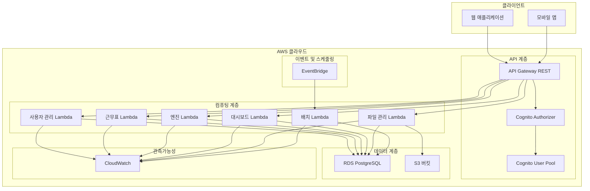
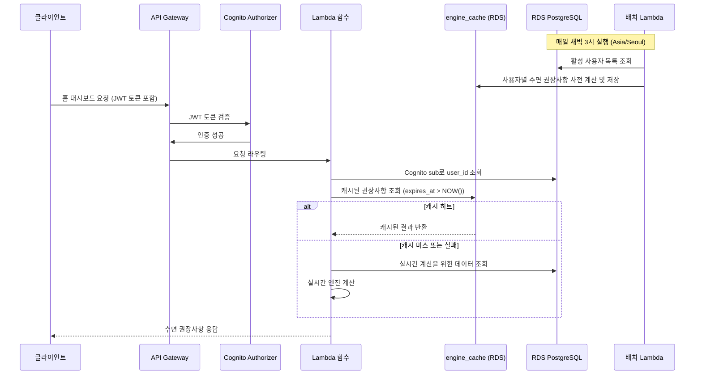
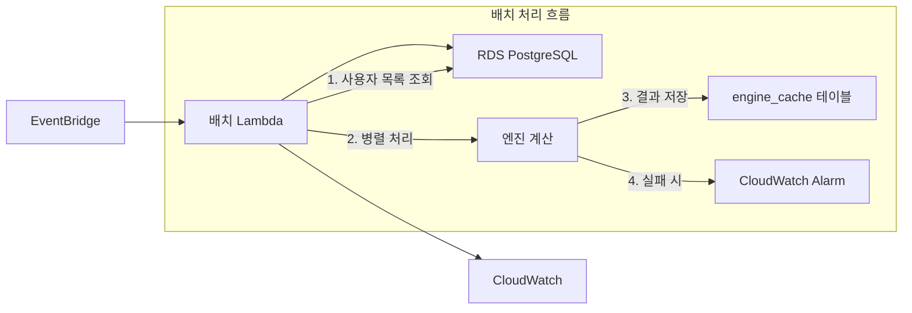

# 교대근무자 수면 최적화 백엔드 시스템 설계 문서

## 개요

교대근무자를 위한 수면 최적화 백엔드 시스템은 AWS 서버리스 아키텍처를 기반으로 구축되며, 개인화된 수면 권장사항과 피로도 평가를 제공합니다. 시스템은 3대 핵심 엔진(Shift-to-Sleep, Caffeine Cutoff, Fatigue Risk Score)을 중심으로 설계되었으며, MVP와 V2 단계로 나누어 점진적으로 기능을 확장합니다.

### 핵심 설계 원칙

1. **서버리스 우선**: 모든 컴퓨팅 리소스는 AWS Lambda를 통해 관리
2. **관계형 데이터베이스**: RDS PostgreSQL을 통한 ACID 트랜잭션과 외래 키 무결성 보장
3. **이벤트 기반 아키텍처**: EventBridge를 통한 배치 작업 및 비동기 처리
4. **보안 우선**: 최소 권한 원칙과 데이터 암호화 적용
5. **관측가능성**: 모든 컴포넌트에 로깅, 메트릭, 알람 적용

## 아키텍처

### 전체 시스템 아키텍처 (AWS 모범 사례)



### 데이터 흐름 아키텍처 (AWS 모범 사례)



## 컴포넌트 및 인터페이스

### 사용자 식별 및 권한 관리

#### Principal 매핑 규칙

**API 내부 식별**: Cognito sub만 신뢰
**DB 작업 식별**: `SELECT user_id FROM users WHERE cognito_sub = $1`로 내부 UUID를 얻어서 모든 쿼리에 사용
**클라이언트 입력 무시**: 클라이언트가 userId를 보내도 무시하고 토큰의 sub만 사용 (Cross-user access 차단)

```typescript
class AuthService {
  async getUserIdFromToken(cognitoSub: string): Promise<string> {
    const query = 'SELECT user_id FROM users WHERE cognito_sub = $1';
    const results = await db.query<{user_id: string}>(query, [cognitoSub]);
    
    if (results.length === 0) {
      throw new Error('User not found');
    }
    
    return results[0].user_id;
  }
}

// 모든 API에서 사용
const userId = await authService.getUserIdFromToken(tokenSub);
// 이후 모든 DB 쿼리는 이 userId만 사용
```

### Lambda 함수 설계

#### 1. 사용자 관리 Lambda

**함수명**: `shift-sleep-user-handler`
**트리거**: API Gateway (Cognito Authorizer 통과 후)
**역할**: 사용자 프로필 CRUD, 온보딩 처리

```typescript
interface UserProfile {
  userId: string;
  shiftType: 'TWO_SHIFT' | 'THREE_SHIFT' | 'FIXED_NIGHT' | 'IRREGULAR';
  commuteMin: number;
  wearableConnected: boolean;
  orgId?: string;
  createdAt: string;
  updatedAt: string;
}

interface OnboardingRequest {
  shiftType: string;
  commuteMin: number;
  wearableSettings: {
    enabled: boolean;
    deviceType?: 'APPLE_HEALTH' | 'GOOGLE_FIT';
  };
}
```

#### 2. 근무표 관리 Lambda

**함수명**: `shift-sleep-schedule-handler`
**트리거**: API Gateway (Cognito Authorizer 통과 후)
**역할**: 근무표 CRUD, 검증, 파일 업로드 처리

```typescript
interface ShiftSchedule {
  userId: string;
  date: string; // YYYY-MM-DD
  shiftType: 'DAY' | 'MID' | 'NIGHT' | 'OFF';
  startAt?: string; // ISO 8601
  endAt?: string; // ISO 8601
  commuteMin: number;
  note?: string;
}

interface ScheduleValidationResult {
  isValid: boolean;
  errors: Array<{
    field: string;
    rule: string;
    message: string;
  }>;
}
```

#### 3. 핵심 엔진 Lambda

**함수명**: `shift-sleep-engine-handler`
**트리거**: API Gateway (Cognito Authorizer 통과 후)
**역할**: 3대 핵심 알고리즘 실행

```typescript
interface EngineRequest {
  userId: string;
  engineType: 'SHIFT_TO_SLEEP' | 'CAFFEINE_CUTOFF' | 'FATIGUE_RISK';
  targetDate?: string; // YYYY-MM-DD, 기본값: 오늘
}

interface EngineResponse<T = any> {
  result?: T;
  whyNotShown?: string;
  dataMissing?: string[];
  generatedAt: string;
}

interface ShiftToSleepResult {
  sleepMain: {
    startAt: string;
    endAt: string;
  };
  sleepNap?: {
    startAt: string;
    endAt: string;
  };
}

interface CaffeineCutoffResult {
  caffeineDeadline: string;
  halfLifeInfo: {
    halfLifeHours: number;
    timeline: Array<{
      hours: number;
      remainingCaffeine: number;
      percentage: number;
    }>;
    safeThreshold: number;
  };
}

interface FatigueRiskResult {
  fatigueScore: number;
  fatigueLevel: 'LOW' | 'MEDIUM' | 'HIGH' | 'CRITICAL';
  breakdown: {
    sleepDeficit: number;
    consecutiveNights: number;
    commute: number;
    additional: number;
  };
  recommendations: string[];
}
```

#### 4. 대시보드 Lambda

**함수명**: `shift-sleep-dashboard-handler`
**트리거**: API Gateway (Cognito Authorizer 통과 후)
**역할**: 홈 대시보드 데이터 집계 및 제공

```typescript
interface DashboardResponse {
  sleepRecommendation: EngineResponse;
  caffeineAdvice: EngineResponse;
  fatigueAssessment: EngineResponse;
  jumpstartProgress: {
    completedItems: number;
    totalItems: number;
    nextAction?: string;
  };
  todaySchedule?: ShiftSchedule;
}
```

#### 5. 파일 관리 Lambda

**함수명**: `shift-sleep-file-handler`
**트리거**: API Gateway (Cognito Authorizer 통과 후), S3 이벤트 (V2)
**역할**: 파일 업로드/다운로드 URL 생성, 파일 메타데이터 관리

```typescript
interface FileUploadRequest {
  fileType: 'SHIFT_SCHEDULE' | 'WEARABLE_DATA' | 'ATTACHMENT';
  contentType: string;
  fileSize: number;
}

interface FileUploadResponse {
  uploadUrl: string;
  fileId: string;
  expiresAt: string;
}
```

#### 6. 배치 처리 Lambda

**함수명**: `shift-sleep-batch-handler`
**트리거**: EventBridge 스케줄
**역할**: 정기 배치 작업 실행

```typescript
interface BatchJobRequest {
  jobType: 'DAILY_CACHE_REFRESH' | 'WEEKLY_STATS_AGGREGATION' | 'DATA_CLEANUP';
  targetDate?: string;
  batchSize?: number;
}
```

### API 엔드포인트 설계 (AWS 모범 사례)

#### 사용자 관리 API

```
POST /api/v1/users/onboarding
GET /api/v1/users/profile
PUT /api/v1/users/profile
DELETE /api/v1/users/profile
```

#### 근무표 관리 API (커서 기반 페이지네이션)

```
GET /api/v1/schedules?limit=30&cursorDate=2024-01-15&cursorId=uuid
POST /api/v1/schedules
PUT /api/v1/schedules/{date}
DELETE /api/v1/schedules/{date}
POST /api/v1/schedules/bulk-import
```

**커서 기반 페이지네이션 구현**:
```sql
-- 첫 페이지
SELECT * FROM shift_schedules 
WHERE user_id = $1 
ORDER BY date ASC, schedule_id ASC 
LIMIT $2;

-- 다음 페이지 (커서 사용)
SELECT * FROM shift_schedules 
WHERE user_id = $1 
  AND (date, schedule_id) > ($cursorDate, $cursorId)
ORDER BY date ASC, schedule_id ASC 
LIMIT $2;
```

**응답 형식**:
```json
{
  "data": [...],
  "nextCursor": {
    "cursorDate": "2024-01-20",
    "cursorId": "uuid-here"
  },
  "hasMore": true
}
```

#### 엔진 API

```
GET /api/v1/engines/shift-to-sleep?date=YYYY-MM-DD
GET /api/v1/engines/caffeine-cutoff?date=YYYY-MM-DD
GET /api/v1/engines/fatigue-risk?date=YYYY-MM-DD
```

#### 대시보드 API

```
GET /api/v1/dashboard/home
GET /api/v1/dashboard/jumpstart
POST /api/v1/dashboard/jumpstart/complete
```

#### 파일 관리 API

```
POST /api/v1/files/upload-url
GET /api/v1/files/{fileId}/download-url
POST /api/v1/files/{fileId}/metadata
GET /api/v1/files/templates/{templateType}
```

#### B2B 통계 API (V2)

```
GET /api/v1/b2b/stats/sleep-quality?orgId=...&from=...&to=...&groupBy=...
GET /api/v1/b2b/stats/fatigue-trends?orgId=...&from=...&to=...&groupBy=...
GET /api/v1/b2b/stats/shift-patterns?orgId=...&from=...&to=...&groupBy=...
```

## 데이터 모델 (RDS PostgreSQL)

### 데이터베이스 스키마 설계

**데이터베이스**: PostgreSQL 14+ (AWS RDS)
**연결 풀링**: RDS Proxy 사용으로 Lambda 연결 최적화

#### 테이블 구조

##### 1. users (사용자 프로필)

```sql
CREATE TABLE users (
    user_id UUID PRIMARY KEY DEFAULT gen_random_uuid(),
    cognito_sub VARCHAR(255) UNIQUE NOT NULL, -- Cognito User Pool subject
    shift_type VARCHAR(20) NOT NULL CHECK (shift_type IN ('TWO_SHIFT', 'THREE_SHIFT', 'FIXED_NIGHT', 'IRREGULAR')),
    commute_min INTEGER NOT NULL CHECK (commute_min >= 0 AND commute_min <= 240),
    wearable_connected BOOLEAN DEFAULT FALSE,
    org_id VARCHAR(255), -- B2B 조직 ID (V2)
    created_at TIMESTAMPTZ DEFAULT NOW(),
    updated_at TIMESTAMPTZ DEFAULT NOW()
);

-- 인덱스
CREATE INDEX idx_users_cognito_sub ON users(cognito_sub);
CREATE INDEX idx_users_org_id ON users(org_id); -- B2B 조회용 (V2)
```

##### 2. shift_schedules (근무표)

```sql
CREATE TABLE shift_schedules (
    schedule_id UUID PRIMARY KEY DEFAULT gen_random_uuid(),
    user_id UUID NOT NULL REFERENCES users(user_id) ON DELETE CASCADE,
    date DATE NOT NULL,
    shift_type VARCHAR(10) NOT NULL CHECK (shift_type IN ('DAY', 'MID', 'NIGHT', 'OFF')),
    start_at TIMESTAMPTZ, -- OFF일 때 NULL
    end_at TIMESTAMPTZ,   -- OFF일 때 NULL
    commute_min INTEGER NOT NULL CHECK (commute_min >= 0 AND commute_min <= 240),
    note TEXT CHECK (LENGTH(note) <= 200),
    created_at TIMESTAMPTZ DEFAULT NOW(),
    updated_at TIMESTAMPTZ DEFAULT NOW(),
    
    -- 제약 조건
    CONSTRAINT unique_user_date UNIQUE (user_id, date),
    CONSTRAINT valid_work_hours CHECK (
        (shift_type = 'OFF' AND start_at IS NULL AND end_at IS NULL) OR
        (shift_type != 'OFF' AND start_at IS NOT NULL AND end_at IS NOT NULL AND 
         EXTRACT(EPOCH FROM (end_at - start_at))/3600 BETWEEN 4 AND 16)
    )
);

-- 인덱스
CREATE INDEX idx_schedules_user_date ON shift_schedules(user_id, date);
CREATE INDEX idx_schedules_date_range ON shift_schedules(user_id, date) WHERE shift_type != 'OFF';
```

##### 3. engine_cache (엔진 계산 캐시)

```sql
CREATE TABLE engine_cache (
    cache_id UUID PRIMARY KEY DEFAULT gen_random_uuid(),
    user_id UUID NOT NULL REFERENCES users(user_id) ON DELETE CASCADE,
    engine_type VARCHAR(20) NOT NULL CHECK (engine_type IN ('SHIFT_TO_SLEEP', 'CAFFEINE_CUTOFF', 'FATIGUE_RISK')),
    target_date DATE NOT NULL,
    result JSONB NOT NULL, -- 엔진별 결과 데이터
    generated_at TIMESTAMPTZ DEFAULT NOW(),
    expires_at TIMESTAMPTZ NOT NULL DEFAULT (NOW() + INTERVAL '48 hours'),
    
    -- 제약 조건
    CONSTRAINT unique_user_engine_date UNIQUE (user_id, engine_type, target_date)
);

-- 인덱스
CREATE INDEX idx_cache_user_engine_date ON engine_cache(user_id, engine_type, target_date);
CREATE INDEX idx_cache_expires_at ON engine_cache(expires_at); -- TTL 정리용

-- TTL 자동 정리 (cron job 또는 Lambda)
-- DELETE FROM engine_cache WHERE expires_at < NOW();
```

##### 4. file_metadata (파일 메타데이터)

```sql
CREATE TABLE file_metadata (
    file_id UUID PRIMARY KEY DEFAULT gen_random_uuid(),
    uploaded_by UUID NOT NULL REFERENCES users(user_id) ON DELETE CASCADE,
    file_type VARCHAR(20) NOT NULL CHECK (file_type IN ('SHIFT_SCHEDULE', 'WEARABLE_DATA', 'ATTACHMENT')),
    content_type VARCHAR(100) NOT NULL,
    file_size BIGINT NOT NULL CHECK (file_size > 0),
    s3_key VARCHAR(500) NOT NULL, -- S3 객체 키
    status VARCHAR(20) DEFAULT 'UPLOADING' CHECK (status IN ('UPLOADING', 'COMPLETED', 'FAILED')),
    created_at TIMESTAMPTZ DEFAULT NOW(),
    updated_at TIMESTAMPTZ DEFAULT NOW()
);

-- 인덱스
CREATE INDEX idx_files_user_type ON file_metadata(uploaded_by, file_type);
CREATE INDEX idx_files_status ON file_metadata(status);
```

##### 5. jumpstart_checklists (점프스타트 체크리스트)

```sql
CREATE TABLE jumpstart_checklists (
    checklist_id UUID PRIMARY KEY DEFAULT gen_random_uuid(),
    user_id UUID NOT NULL REFERENCES users(user_id) ON DELETE CASCADE,
    item_key VARCHAR(100) NOT NULL, -- 체크리스트 항목 식별자
    title VARCHAR(200) NOT NULL,
    description TEXT,
    completed BOOLEAN DEFAULT FALSE,
    completed_at TIMESTAMPTZ,
    created_at TIMESTAMPTZ DEFAULT NOW(),
    
    -- 제약 조건
    CONSTRAINT unique_user_item UNIQUE (user_id, item_key)
);

-- 인덱스
CREATE INDEX idx_checklist_user ON jumpstart_checklists(user_id);
CREATE INDEX idx_checklist_completed ON jumpstart_checklists(user_id, completed);
```

##### 6. b2b_stats_aggregates (B2B 통계 집계 - V2)

```sql
CREATE TABLE b2b_stats_aggregates (
    aggregate_id UUID PRIMARY KEY DEFAULT gen_random_uuid(),
    org_id VARCHAR(255) NOT NULL,
    period_type VARCHAR(10) NOT NULL CHECK (period_type IN ('DAILY', 'WEEKLY', 'MONTHLY')),
    period_start DATE NOT NULL,
    period_end DATE NOT NULL,
    group_by VARCHAR(50), -- 'shift_type', 'department' 등
    group_value VARCHAR(100),
    metric_name VARCHAR(50) NOT NULL, -- 'avg_sleep_hours', 'fatigue_score' 등
    metric_value DECIMAL(10,2) NOT NULL,
    participant_count INTEGER NOT NULL CHECK (participant_count >= 3), -- 최소 3명
    created_at TIMESTAMPTZ DEFAULT NOW(),
    
    -- 제약 조건
    CONSTRAINT unique_org_period_metric UNIQUE (org_id, period_type, period_start, group_by, group_value, metric_name)
);

-- 인덱스
CREATE INDEX idx_b2b_stats_org_period ON b2b_stats_aggregates(org_id, period_type, period_start);
CREATE INDEX idx_b2b_stats_participant_count ON b2b_stats_aggregates(participant_count);
```

### 캐시 관리 전략

#### Source of Truth: engine_cache 테이블

**공식 캐시**: `engine_cache` 테이블 (TTL=48h, 조회 시 `expires_at > NOW()`)
**인메모리 캐시**: 보조 캐시 (5분 TTL), engine_cache와 값 동일할 때만 사용
**캐시 무효화**: `DELETE FROM engine_cache WHERE user_id = $1 AND target_date >= $date`

```typescript
class CacheManager {
  async invalidateUserCache(userId: string, fromDate: string): Promise<void> {
    // 캐시 무효화 표준 쿼리
    const query = `
      DELETE FROM engine_cache 
      WHERE user_id = $1 AND target_date >= $2
    `;
    await db.query(query, [userId, fromDate]);
  }

  async getCachedResult<T>(userId: string, engineType: string, targetDate: string): Promise<T | null> {
    const query = `
      SELECT result FROM engine_cache 
      WHERE user_id = $1 AND engine_type = $2 AND target_date = $3 
        AND expires_at > NOW()
    `;
    const results = await db.query<{result: T}>(query, [userId, engineType, targetDate]);
    return results.length > 0 ? results[0].result : null;
  }
}

### 데이터베이스 연결 및 최적화

```typescript
// Lambda에서 RDS Proxy 연결
import { Pool } from 'pg';

const pool = new Pool({
  host: process.env.RDS_PROXY_ENDPOINT,
  port: 5432,
  database: process.env.DB_NAME,
  user: process.env.DB_USER,
  password: process.env.DB_PASSWORD,
  ssl: { rejectUnauthorized: false },
  max: 2, // Lambda당 최대 연결 수
  idleTimeoutMillis: 30000,
  connectionTimeoutMillis: 2000
});

export const query = async (text: string, params?: any[]) => {
  const client = await pool.connect();
  try {
    const result = await client.query(text, params);
    return result;
  } finally {
    client.release();
  }
};
```

#### RDS Proxy 설정

#### 주요 쿼리 패턴

##### 1. 커서 기반 근무표 조회

```sql
-- 첫 페이지
SELECT * FROM shift_schedules 
WHERE user_id = $1 
ORDER BY date ASC, schedule_id ASC 
LIMIT $2;

-- 다음 페이지
SELECT * FROM shift_schedules 
WHERE user_id = $1 AND (date, schedule_id) > ($2, $3)
ORDER BY date ASC, schedule_id ASC 
LIMIT $4;
```

##### 2. 엔진 캐시 조회 (TTL 고려)

```sql
SELECT result FROM engine_cache 
WHERE user_id = $1 AND engine_type = $2 AND target_date = $3 
  AND expires_at > NOW();
```

##### 3. 사용자 프로필 조회

```sql
SELECT * FROM users WHERE cognito_sub = $1;
```

##### 4. 근무표 겹침 검증

```sql
SELECT COUNT(*) FROM shift_schedules 
WHERE user_id = $1 AND date = $2 AND shift_type != 'OFF'
  AND (start_at, end_at) OVERLAPS ($3, $4);
```

##### 5. B2B 통계 조회 (V2)

```sql
SELECT metric_name, metric_value, participant_count 
FROM b2b_stats_aggregates 
WHERE org_id = $1 AND period_type = $2 
  AND period_start BETWEEN $3 AND $4
  AND participant_count >= 3;
```

### 트랜잭션 처리

#### 온보딩 트랜잭션

```sql
BEGIN;
INSERT INTO users (cognito_sub, shift_type, commute_min, wearable_connected) 
VALUES ($1, $2, $3, $4) RETURNING user_id;

INSERT INTO jumpstart_checklists (user_id, item_key, title, description) 
VALUES ($5, 'setup_schedule', '근무표 설정', '첫 주 근무표를 입력해보세요');
COMMIT;
```

#### 근무표 업데이트 + 캐시 무효화

```sql
BEGIN;
UPDATE shift_schedules 
SET shift_type = $2, start_at = $3, end_at = $4, commute_min = $5, updated_at = NOW()
WHERE user_id = $1 AND date = $6;

DELETE FROM engine_cache 
WHERE user_id = $1 AND target_date >= $6;
COMMIT;
```

### 성능 최적화

#### 연결 풀 관리

```typescript
class DatabaseService {
  private static instance: DatabaseService;
  private pool: Pool;

  private constructor() {
    this.pool = new Pool({
      host: process.env.RDS_PROXY_ENDPOINT,
      port: 5432,
      database: process.env.DB_NAME,
      user: process.env.DB_USER,
      password: process.env.DB_PASSWORD,
      ssl: { rejectUnauthorized: false },
      max: 2, // Lambda 환경에서 적절한 연결 수
      idleTimeoutMillis: 30000,
      connectionTimeoutMillis: 2000
    });
  }

  public static getInstance(): DatabaseService {
    if (!DatabaseService.instance) {
      DatabaseService.instance = new DatabaseService();
    }
    return DatabaseService.instance;
  }

  async query<T>(text: string, params?: any[]): Promise<T[]> {
    const client = await this.pool.connect();
    try {
      const result = await client.query(text, params);
      return result.rows;
    } finally {
      client.release();
    }
  }

  async transaction<T>(callback: (client: any) => Promise<T>): Promise<T> {
    const client = await this.pool.connect();
    try {
      await client.query('BEGIN');
      const result = await callback(client);
      await client.query('COMMIT');
      return result;
    } catch (error) {
      await client.query('ROLLBACK');
      throw error;
    } finally {
      client.release();
    }
  }
}
```

#### 캐시 TTL 정리 배치

```sql
-- 매일 실행되는 정리 쿼리
DELETE FROM engine_cache WHERE expires_at < NOW() - INTERVAL '1 hour';
```

### 데이터 일관성 및 트랜잭션

#### 트랜잭션 사용 사례

1. **사용자 온보딩**: 사용자 프로필 + 초기 설정 동시 생성
2. **근무표 대량 업데이트**: 여러 날짜의 근무표 동시 수정
3. **캐시 무효화**: 관련된 모든 엔진 캐시 동시 삭제

```typescript
// 온보딩 트랜잭션 예시
const transactParams = {
  TransactItems: [
    {
      Put: {
        TableName: 'shift-sleep-main-table',
        Item: userProfileItem,
        ConditionExpression: 'attribute_not_exists(PK)'
      }
    },
    {
      Put: {
        TableName: 'shift-sleep-main-table',
        Item: initialSettingsItem
      }
    }
  ]
};
```

## 핵심 알고리즘 엔진 설계

### 1. Shift-to-Sleep 엔진

#### 알고리즘 개요

교대근무자의 근무 패턴을 분석하여 최적의 수면창(메인 수면 + 파워냅)을 계산합니다. 연구에 따르면 수면-각성 패턴을 일주기 리듬과 정렬시키는 것이 수면 부족보다 더 중요합니다.

#### 입력 데이터

```typescript
interface ShiftToSleepInput {
  userId: string;
  targetDate: string;
  currentSchedule: ShiftSchedule;
  upcomingSchedules: ShiftSchedule[]; // 다음 3일
  userProfile: {
    shiftType: string;
    commuteMin: number;
    chronotype?: 'MORNING' | 'EVENING' | 'INTERMEDIATE'; // V2
  };
  sleepHistory?: SleepRecord[]; // V2 웨어러블 데이터
}
```

#### 계산 로직

```typescript
class ShiftToSleepEngine {
  calculate(input: ShiftToSleepInput): EngineResponse {
    // 1. 데이터 유효성 검증
    const validation = this.validateInput(input);
    if (!validation.isValid) {
      return {
        whyNotShown: 'INSUFFICIENT_DATA',
        dataMissing: validation.missingData,
        generatedAt: new Date().toISOString()
      };
    }

    // 2. 기본 수면 필요량 계산 (성인 기준 7-9시간)
    const baseSleepNeed = 8 * 60; // 480분

    // 3. 근무 패턴 분석
    const workPattern = this.analyzeWorkPattern(input.currentSchedule, input.upcomingSchedules);
    
    // 4. 최적 수면창 계산
    const sleepWindows = this.calculateOptimalSleepWindows(
      input.currentSchedule,
      workPattern,
      input.userProfile.commuteMin,
      baseSleepNeed
    );

    // 5. 파워냅 권장사항 계산
    const napRecommendation = this.calculateNapRecommendation(
      sleepWindows.main,
      workPattern
    );

    return {
      result: {
        sleepMain: sleepWindows.main,
        sleepNap: napRecommendation
      },
      generatedAt: new Date().toISOString()
    };
  }

  private calculateOptimalSleepWindows(
    currentSchedule: ShiftSchedule,
    workPattern: WorkPattern,
    commuteMin: number,
    baseSleepNeed: number
  ): { main: SleepWindow } {
    const workStart = new Date(currentSchedule.startAt!);
    const workEnd = new Date(currentSchedule.endAt!);
    
    // 통근 시간 고려
    const arrivalTime = new Date(workStart.getTime() - commuteMin * 60000);
    const departureTime = new Date(workEnd.getTime() + commuteMin * 60000);
    
    // 근무 유형별 최적 수면 시작 시간 계산
    let optimalSleepStart: Date;
    
    switch (currentSchedule.shiftType) {
      case 'DAY':
        // 오전 근무: 전날 밤 22:00-23:00 사이 수면 시작
        optimalSleepStart = new Date(arrivalTime.getTime() - (baseSleepNeed + 60) * 60000);
        break;
      case 'MID':
        // 오후 근무: 오전 08:00-09:00 사이 수면 시작
        optimalSleepStart = new Date(arrivalTime.getTime() - (baseSleepNeed + 120) * 60000);
        break;
      case 'NIGHT':
        // 야간 근무: 오후 13:00-15:00 사이 수면 시작
        optimalSleepStart = new Date(arrivalTime.getTime() - (baseSleepNeed + 180) * 60000);
        break;
      default:
        throw new Error('Invalid shift type');
    }
    
    const optimalSleepEnd = new Date(optimalSleepStart.getTime() + baseSleepNeed * 60000);
    
    return {
      main: {
        startAt: this.formatToKST(optimalSleepStart),
        endAt: this.formatToKST(optimalSleepEnd)
      }
    };
  }

  private formatToKST(date: Date): string {
    // 내부는 항상 UTC epoch, 외부 출력만 KST로 변환
    // Intl.DateTimeFormat을 사용한 안전한 시간대 변환
    const formatter = new Intl.DateTimeFormat('sv-SE', {
      timeZone: 'Asia/Seoul',
      year: 'numeric',
      month: '2-digit',
      day: '2-digit',
      hour: '2-digit',
      minute: '2-digit',
      second: '2-digit',
      hour12: false
    });
    
    const parts = formatter.formatToParts(date);
    const year = parts.find(p => p.type === 'year')?.value;
    const month = parts.find(p => p.type === 'month')?.value;
    const day = parts.find(p => p.type === 'day')?.value;
    const hour = parts.find(p => p.type === 'hour')?.value;
    const minute = parts.find(p => p.type === 'minute')?.value;
    const second = parts.find(p => p.type === 'second')?.value;
    
    return `${year}-${month}-${day}T${hour}:${minute}:${second}+09:00`;
  }

  private calculateNapRecommendation(
    mainSleep: SleepWindow,
    workPattern: WorkPattern
  ): SleepWindow | undefined {
    // 야간 근무자에게만 파워냅 권장
    if (workPattern.isNightShift) {
      const napStart = new Date(mainSleep.endAt);
      napStart.setHours(napStart.getHours() + 4); // 메인 수면 후 4시간 뒤
      
      const napEnd = new Date(napStart.getTime() + 90 * 60000); // 90분 파워냅
      
      return {
        startAt: this.formatToKST(napStart),
        endAt: this.formatToKST(napEnd)
      };
    }
    
    return undefined;
  }
}
```

### 2. Caffeine Cutoff 엔진

#### 알고리즘 개요

카페인의 반감기(평균 5시간, 개인차 1.5-9.5시간)를 고려하여 수면에 영향을 주지 않는 카페인 마감시간을 계산합니다.

#### 계산 로직

```typescript
class CaffeineCutoffEngine {
  private readonly CAFFEINE_HALF_LIFE_HOURS = 5; // 평균 반감기
  private readonly SLEEP_INTERFERENCE_THRESHOLD = 25; // mg, 수면 방해 임계값

  calculate(input: CaffeineInput): EngineResponse {
    const validation = this.validateInput(input);
    if (!validation.isValid) {
      return {
        whyNotShown: 'INSUFFICIENT_DATA',
        dataMissing: validation.missingData,
        generatedAt: new Date().toISOString()
      };
    }

    // 1. 목표 수면 시간 가져오기
    const sleepStartTime = new Date(input.targetSleepTime);
    
    // 2. 카페인이 수면 방해 임계값 이하로 떨어지는 시간 계산
    const hoursNeeded = this.calculateHoursToThreshold(
      input.typicalCaffeineAmount || 100, // 기본 100mg (커피 1잔)
      this.SLEEP_INTERFERENCE_THRESHOLD
    );
    
    // 3. 카페인 마감시간 계산
    const cutoffTime = new Date(sleepStartTime.getTime() - hoursNeeded * 60 * 60 * 1000);
    
    // 4. 반감기 정보 제공
    const halfLifeInfo = this.generateHalfLifeInfo(input.typicalCaffeineAmount || 100);
    
    return {
      result: {
        caffeineDeadline: this.formatToKST(cutoffTime),
        halfLifeInfo: halfLifeInfo
      },
      generatedAt: this.formatToKST(new Date())
    };
  }

  private calculateHoursToThreshold(initialAmount: number, threshold: number): number {
    // 카페인 농도가 임계값 이하로 떨어지는 시간 계산
    // C(t) = C0 * (1/2)^(t/half_life)
    // threshold = initialAmount * (1/2)^(t/5)
    // t = 5 * log2(initialAmount / threshold)
    
    if (initialAmount <= threshold) {
      return 0;
    }
    
    return this.CAFFEINE_HALF_LIFE_HOURS * Math.log2(initialAmount / threshold);
  }

  private generateHalfLifeInfo(initialAmount: number): any {
    const timeline = [];
    let currentAmount = initialAmount;
    let hours = 0;
    
    while (currentAmount > this.SLEEP_INTERFERENCE_THRESHOLD && hours <= 12) {
      timeline.push({
        hours: hours,
        remainingCaffeine: Math.round(currentAmount),
        percentage: Math.round((currentAmount / initialAmount) * 100)
      });
      
      hours += this.CAFFEINE_HALF_LIFE_HOURS;
      currentAmount = currentAmount / 2;
    }
    
    return {
      halfLifeHours: this.CAFFEINE_HALF_LIFE_HOURS,
      timeline: timeline,
      safeThreshold: this.SLEEP_INTERFERENCE_THRESHOLD
    };
  }
}
```

### 3. Fatigue Risk Score 엔진

#### 알고리즘 개요

평균 수면시간, 연속 야간근무 일수, 통근 운전 시간을 종합하여 피로도 위험 점수(0-100)를 계산합니다.

#### 계산 로직

```typescript
class FatigueRiskEngine {
  calculate(input: FatigueRiskInput): EngineResponse {
    const validation = this.validateInput(input);
    if (!validation.isValid) {
      return {
        whyNotShown: 'INSUFFICIENT_DATA',
        dataMissing: validation.missingData,
        generatedAt: new Date().toISOString()
      };
    }

    // 1. 수면 부족 점수 계산 (0-40점)
    const sleepDeficitScore = this.calculateSleepDeficitScore(input.recentSleepHours);
    
    // 2. 연속 야간근무 점수 계산 (0-30점)
    const consecutiveNightScore = this.calculateConsecutiveNightScore(input.consecutiveNightShifts);
    
    // 3. 통근 피로 점수 계산 (0-20점)
    const commuteScore = this.calculateCommuteScore(input.commuteMin, input.isDriving);
    
    // 4. 추가 위험 요소 점수 (0-10점)
    const additionalRiskScore = this.calculateAdditionalRiskScore(input);
    
    // 5. 총 점수 계산
    const totalScore = Math.min(100, 
      sleepDeficitScore + consecutiveNightScore + commuteScore + additionalRiskScore
    );
    
    // 6. 위험 레벨 결정
    const riskLevel = this.determineRiskLevel(totalScore);
    
    return {
      result: {
        fatigueScore: totalScore,
        fatigueLevel: riskLevel,
        breakdown: {
          sleepDeficit: sleepDeficitScore,
          consecutiveNights: consecutiveNightScore,
          commute: commuteScore,
          additional: additionalRiskScore
        },
        recommendations: this.generateRecommendations(riskLevel, input)
      },
      generatedAt: this.formatToKST(new Date())
    };
  }

  private calculateSleepDeficitScore(recentSleepHours: number[]): number {
    if (recentSleepHours.length === 0) return 0;
    
    const averageSleep = recentSleepHours.reduce((a, b) => a + b, 0) / recentSleepHours.length;
    const optimalSleep = 8;
    
    if (averageSleep >= optimalSleep) return 0;
    if (averageSleep >= 7) return 10;
    if (averageSleep >= 6) return 20;
    if (averageSleep >= 5) return 30;
    return 40;
  }

  private calculateConsecutiveNightScore(consecutiveNights: number): number {
    if (consecutiveNights <= 1) return 0;
    if (consecutiveNights <= 2) return 10;
    if (consecutiveNights <= 3) return 20;
    return 30;
  }

  private calculateCommuteScore(commuteMin: number, isDriving: boolean): number {
    const baseScore = Math.min(15, Math.floor(commuteMin / 30) * 5);
    return isDriving ? baseScore + 5 : baseScore;
  }

  private determineRiskLevel(score: number): 'LOW' | 'MEDIUM' | 'HIGH' | 'CRITICAL' {
    if (score <= 25) return 'LOW';
    if (score <= 50) return 'MEDIUM';
    if (score <= 75) return 'HIGH';
    return 'CRITICAL';
  }
}
```

## 배치 작업 및 스케줄링

### EventBridge 스케줄 설계

#### 1. 일일 캐시 갱신 작업

**스케줄**: 매일 새벽 3시 (Asia/Seoul) - EventBridge Scheduler 사용
**대상**: `shift-sleep-batch-handler`
**페이로드**:

```json
{
  "jobType": "DAILY_CACHE_REFRESH",
  "targetDate": "2024-01-26",
  "batchSize": 100
}
```

**EventBridge Scheduler 설정**:
```typescript
const dailyCacheRule = new ScheduleGroup(this, 'DailyCacheSchedule', {
  scheduleExpression: ScheduleExpression.cron({
    minute: '0',
    hour: '3',
    day: '*',
    month: '*',
    year: '*'
  }),
  timezone: 'Asia/Seoul', // 명시적 시간대 설정
  target: new LambdaInvoke(batchHandler, {
    payload: RuleTargetInput.fromObject({
      jobType: 'DAILY_CACHE_REFRESH'
      // targetDate는 배치 Lambda에서 실행 시점 기준으로 계산
    })
  })
});
```

**배치 Lambda에서 날짜 계산**:
```typescript
export const batchHandler = async (event: BatchJobRequest) => {
  // 실행 시점 기준으로 오늘/내일 계산 (문자열 파싱 없는 방식)
  const nowEpoch = Date.now();
  const kstOffset = 9 * 60 * 60 * 1000; // 9시간을 밀리초로
  const nowKST = new Date(nowEpoch + kstOffset);
  
  const today = nowKST.toISOString().split('T')[0]; // YYYY-MM-DD
  const tomorrowEpoch = nowEpoch + 24 * 60 * 60 * 1000;
  const tomorrowKST = new Date(tomorrowEpoch + kstOffset);
  const tomorrow = tomorrowKST.toISOString().split('T')[0];
  
  // 오늘/내일 캐시 생성
  await generateCacheForDates([today, tomorrow]);
};
```

**처리 로직**:
1. 활성 사용자 목록 조회 (최근 7일 내 활동)
2. 사용자별로 오늘/내일 수면 권장사항 계산
3. DynamoDB에 캐시 저장 (TTL: 48시간)
4. 실패한 사용자는 SQS DLQ로 전송

#### 2. 주간 통계 집계 작업 (V2)

**스케줄**: 매주 월요일 새벽 4시
**대상**: `shift-sleep-batch-handler`
**페이로드**:

```json
{
  "jobType": "WEEKLY_STATS_AGGREGATION",
  "targetWeek": "2024-W04",
  "batchSize": 50
}
```

#### 3. 데이터 정리 작업

**스케줄**: 매월 1일 새벽 5시
**대상**: `shift-sleep-batch-handler`
**페이로드**:

```json
{
  "jobType": "DATA_CLEANUP",
  "retentionDays": 365
}
```

### 배치 처리 아키텍처



## 보안 및 컴플라이언스

### IAM 역할 및 정책

#### Lambda 실행 역할 (RDS 기반)

```json
{
  "Version": "2012-10-17",
  "Statement": [
    {
      "Effect": "Allow",
      "Action": [
        "rds-db:connect"
      ],
      "Resource": [
        "arn:aws:rds-db:ap-northeast-2:*:dbuser:*/lambda-db-user"
      ]
    },
    {
      "Effect": "Allow",
      "Action": [
        "s3:GetObject",
        "s3:PutObject",
        "s3:DeleteObject"
      ],
      "Resource": "arn:aws:s3:::shift-sleep-files/*"
    },
    {
      "Effect": "Allow",
      "Action": [
        "logs:CreateLogGroup",
        "logs:CreateLogStream",
        "logs:PutLogEvents"
      ],
      "Resource": "arn:aws:logs:ap-northeast-2:*:*"
    }
  ]
}
```

### 데이터 암호화

#### 저장 시 암호화

- **DynamoDB**: SSE-S3 기본 암호화 적용
- **S3**: SSE-S3 암호화 적용
- **CloudWatch Logs**: 기본 암호화 적용

#### 전송 시 암호화

- 모든 API 통신은 HTTPS/TLS 1.2 이상 사용
- Lambda 간 통신은 AWS 내부 네트워크 사용

### 개인정보 보호

#### 데이터 마스킹

```typescript
class DataMaskingUtil {
  static maskEmail(email: string): string {
    const [local, domain] = email.split('@');
    const maskedLocal = local.charAt(0) + '*'.repeat(local.length - 1);
    return `${maskedLocal}@${domain}`;
  }

  static maskUserId(userId: string): string {
    return userId.substring(0, 8) + '***';
  }

  static sanitizeLogData(data: any): any {
    const sanitized = { ...data };
    
    if (sanitized.email) {
      sanitized.email = this.maskEmail(sanitized.email);
    }
    
    if (sanitized.userId) {
      sanitized.userId = this.maskUserId(sanitized.userId);
    }
    
    // 민감한 필드 제거
    delete sanitized.password;
    delete sanitized.ssn;
    delete sanitized.phoneNumber;
    
    return sanitized;
  }
}
```

#### B2B 익명화 규칙

```typescript
class B2BAnonymizationService {
  private readonly MIN_GROUP_SIZE = 3;

  async getAnonymizedStats(request: B2BStatsRequest): Promise<B2BStatsResponse> {
    // 1. 권한 검증
    await this.validateB2BAccess(request.orgId, request.requesterId);
    
    // 2. 그룹 크기 검증
    const groupSize = await this.getGroupSize(request.filters);
    if (groupSize < this.MIN_GROUP_SIZE) {
      throw new Error('Insufficient group size for anonymization');
    }
    
    // 3. 집계 데이터 조회 (개인 데이터 직접 접근 금지)
    const aggregatedData = await this.getAggregatedData(request);
    
    // 4. 최종 방어 검증
    return this.validateAndReturnStats(aggregatedData, groupSize);
  }

  private async validateAndReturnStats(data: any, groupSize: number): Promise<B2BStatsResponse> {
    // Defense in Depth: 최종 단계에서 한번 더 검증
    if (groupSize < this.MIN_GROUP_SIZE) {
      throw new Error('Final validation failed: group size too small');
    }
    
    return {
      data: data,
      groupSize: groupSize,
      anonymized: true,
      generatedAt: new Date().toISOString()
    };
  }
}
```

## 에러 처리

### 에러 분류 및 처리 전략

#### 1. 클라이언트 에러 (4xx)

```typescript
class ClientError extends Error {
  constructor(
    public code: string,
    public message: string,
    public details?: any
  ) {
    super(message);
    this.name = 'ClientError';
  }
}

// 사용 예시
throw new ClientError(
  'VALIDATION_ERROR',
  '근무 시간이 올바르지 않습니다',
  { field: 'startAt', rule: 'must_be_before_endAt' }
);
```

#### 2. 서버 에러 (5xx)

```typescript
class ServerError extends Error {
  constructor(
    public code: string,
    public message: string,
    public originalError?: Error
  ) {
    super(message);
    this.name = 'ServerError';
  }
}

// 사용 예시
try {
  await dynamoClient.putItem(params).promise();
} catch (error) {
  throw new ServerError(
    'DATABASE_ERROR',
    '데이터 저장 중 오류가 발생했습니다',
    error
  );
}
```

#### 3. 엔진 계산 에러

```typescript
class EngineCalculationError extends Error {
  constructor(
    public engineType: string,
    public reason: string,
    public missingData?: string[]
  ) {
    super(`Engine calculation failed: ${reason}`);
    this.name = 'EngineCalculationError';
  }
}
```

### 글로벌 에러 핸들러

```typescript
class GlobalErrorHandler {
  static handle(error: Error, context: any): APIGatewayProxyResult {
    const correlationId = context.correlationId || 'unknown';
    
    // 로깅
    console.error('Error occurred:', {
      correlationId,
      error: error.message,
      stack: error.stack,
      context: DataMaskingUtil.sanitizeLogData(context)
    });

    if (error instanceof ClientError) {
      return {
        statusCode: 400,
        headers: {
          'Content-Type': 'application/json',
          'X-Correlation-Id': correlationId
        },
        body: JSON.stringify({
          error: {
            code: error.code,
            message: error.message,
            details: error.details
          },
          correlationId
        })
      };
    }

    if (error instanceof ServerError) {
      return {
        statusCode: 500,
        headers: {
          'Content-Type': 'application/json',
          'X-Correlation-Id': correlationId
        },
        body: JSON.stringify({
          error: {
            code: error.code,
            message: '서버 내부 오류가 발생했습니다'
          },
          correlationId
        })
      };
    }

    // 예상하지 못한 에러
    return {
      statusCode: 500,
      headers: {
        'Content-Type': 'application/json',
        'X-Correlation-Id': correlationId
      },
      body: JSON.stringify({
        error: {
          code: 'INTERNAL_ERROR',
          message: '예상하지 못한 오류가 발생했습니다'
        },
        correlationId
      })
    };
  }
}
```

## 테스팅 전략

### 단위 테스트

각 Lambda 함수와 엔진 클래스에 대한 단위 테스트를 작성합니다.

```typescript
// 예시: Shift-to-Sleep 엔진 테스트
describe('ShiftToSleepEngine', () => {
  let engine: ShiftToSleepEngine;

  beforeEach(() => {
    engine = new ShiftToSleepEngine();
  });

  describe('야간 근무 수면 권장사항', () => {
    it('야간 근무자에게 오후 수면창을 권장해야 함', () => {
      const input = {
        userId: 'test-user',
        targetDate: '2024-01-26',
        currentSchedule: {
          shiftType: 'NIGHT',
          startAt: '2024-01-26T22:00:00+09:00',
          endAt: '2024-01-27T07:00:00+09:00',
          commuteMin: 30
        },
        upcomingSchedules: [],
        userProfile: {
          shiftType: 'THREE_SHIFT',
          commuteMin: 30
        }
      };

      const result = engine.calculate(input);

      expect(result.result).toBeDefined();
      expect(result.result!.sleepMain.startAt).toMatch(/T1[3-5]:/); // 오후 1-3시 사이
      expect(result.result!.sleepNap).toBeDefined(); // 파워냅 권장
    });

    it('데이터가 부족할 때 whyNotShown을 반환해야 함', () => {
      const input = {
        userId: 'test-user',
        targetDate: '2024-01-26',
        currentSchedule: null, // 데이터 없음
        upcomingSchedules: [],
        userProfile: {
          shiftType: 'THREE_SHIFT',
          commuteMin: 30
        }
      };

      const result = engine.calculate(input);

      expect(result.whyNotShown).toBe('INSUFFICIENT_DATA');
      expect(result.dataMissing).toContain('SHIFT_SCHEDULE_TODAY');
    });
  });
});
```

### 통합 테스트

실제 AWS 서비스와의 통합을 테스트합니다.

```typescript
describe('사용자 관리 API 통합 테스트', () => {
  let testUserId: string;

  beforeAll(async () => {
    // 테스트 환경 설정
    await setupTestEnvironment();
  });

  afterAll(async () => {
    // 테스트 데이터 정리
    await cleanupTestData(testUserId);
  });

  it('사용자 온보딩 전체 플로우', async () => {
    // 1. 온보딩 요청
    const onboardingResponse = await request(app)
      .post('/api/v1/users/onboarding')
      .send({
        shiftType: 'THREE_SHIFT',
        commuteMin: 30,
        wearableSettings: {
          enabled: true,
          deviceType: 'APPLE_HEALTH'
        }
      })
      .expect(201);

    testUserId = onboardingResponse.body.data.userId;

    // 2. 프로필 조회
    const profileResponse = await request(app)
      .get('/api/v1/users/profile')
      .set('Authorization', `Bearer ${testJWT}`)
      .expect(200);

    expect(profileResponse.body.data.shiftType).toBe('THREE_SHIFT');
    expect(profileResponse.body.data.commuteMin).toBe(30);
  });
});
```

### 성능 테스트

시스템의 성능과 확장성을 검증합니다.

```typescript
describe('성능 테스트', () => {
  it('엔진 계산 응답시간이 1초 이내여야 함', async () => {
    const startTime = Date.now();
    
    const result = await shiftToSleepEngine.calculate(testInput);
    
    const responseTime = Date.now() - startTime;
    expect(responseTime).toBeLessThan(1000);
    expect(result.result).toBeDefined();
  });

  it('동시 요청 100개 처리 가능해야 함', async () => {
    const promises = Array.from({ length: 100 }, (_, i) => 
      request(app)
        .get('/api/v1/dashboard/home')
        .set('Authorization', `Bearer ${testJWT}`)
    );

    const results = await Promise.all(promises);
    
    results.forEach(result => {
      expect(result.status).toBe(200);
    });
  });
});
```

## 관측가능성

### 로깅 전략

#### 구조화된 로깅

```typescript
class Logger {
  private correlationId: string;

  constructor(correlationId: string) {
    this.correlationId = correlationId;
  }

  info(message: string, data?: any): void {
    console.log(JSON.stringify({
      level: 'INFO',
      timestamp: new Date().toISOString(),
      correlationId: this.correlationId,
      message,
      data: data ? DataMaskingUtil.sanitizeLogData(data) : undefined
    }));
  }

  error(message: string, error?: Error, data?: any): void {
    console.error(JSON.stringify({
      level: 'ERROR',
      timestamp: new Date().toISOString(),
      correlationId: this.correlationId,
      message,
      error: error ? {
        name: error.name,
        message: error.message,
        stack: error.stack
      } : undefined,
      data: data ? DataMaskingUtil.sanitizeLogData(data) : undefined
    }));
  }

  warn(message: string, data?: any): void {
    console.warn(JSON.stringify({
      level: 'WARN',
      timestamp: new Date().toISOString(),
      correlationId: this.correlationId,
      message,
      data: data ? DataMaskingUtil.sanitizeLogData(data) : undefined
    }));
  }
}
```

#### 로그 집계 및 분석

```typescript
// CloudWatch Insights 쿼리 예시
const logQueries = {
  // 에러율 분석
  errorRate: `
    fields @timestamp, level, message, correlationId
    | filter level = "ERROR"
    | stats count() by bin(5m)
  `,
  
  // 응답시간 분석
  responseTime: `
    fields @timestamp, @duration
    | filter @type = "REPORT"
    | stats avg(@duration), max(@duration), min(@duration) by bin(5m)
  `,
  
  // 엔진별 성능 분석
  enginePerformance: `
    fields @timestamp, message, data.engineType, data.executionTime
    | filter message like /Engine calculation completed/
    | stats avg(data.executionTime) by data.engineType
  `
};
```

### 메트릭 수집

#### 커스텀 메트릭

```typescript
class MetricsCollector {
  private cloudWatch: AWS.CloudWatch;

  constructor() {
    this.cloudWatch = new AWS.CloudWatch();
  }

  async recordEngineExecutionTime(engineType: string, executionTime: number): Promise<void> {
    await this.cloudWatch.putMetricData({
      Namespace: 'ShiftSleep/Engines',
      MetricData: [{
        MetricName: 'ExecutionTime',
        Dimensions: [{
          Name: 'EngineType',
          Value: engineType
        }],
        Value: executionTime,
        Unit: 'Milliseconds',
        Timestamp: new Date()
      }]
    }).promise();
  }

  async recordCacheHitRate(engineType: string, isHit: boolean): Promise<void> {
    await this.cloudWatch.putMetricData({
      Namespace: 'ShiftSleep/Cache',
      MetricData: [{
        MetricName: 'HitRate',
        Dimensions: [{
          Name: 'EngineType',
          Value: engineType
        }],
        Value: isHit ? 1 : 0,
        Unit: 'Count',
        Timestamp: new Date()
      }]
    }).promise();
  }

  async recordUserActivity(activityType: string): Promise<void> {
    await this.cloudWatch.putMetricData({
      Namespace: 'ShiftSleep/UserActivity',
      MetricData: [{
        MetricName: 'ActivityCount',
        Dimensions: [{
          Name: 'ActivityType',
          Value: activityType
        }],
        Value: 1,
        Unit: 'Count',
        Timestamp: new Date()
      }]
    }).promise();
  }
}
```

### 알람 설정

#### CloudWatch 알람 구성

```typescript
const alarmConfigurations = [
  {
    AlarmName: 'ShiftSleep-HighErrorRate',
    AlarmDescription: '5분간 에러율이 1%를 초과할 때 알람',
    MetricName: 'Errors',
    Namespace: 'AWS/Lambda',
    Statistic: 'Sum',
    Period: 300,
    EvaluationPeriods: 1,
    Threshold: 1,
    ComparisonOperator: 'GreaterThanThreshold',
    AlarmActions: ['arn:aws:sns:ap-northeast-2:123456789012:shift-sleep-alerts']
  },
  {
    AlarmName: 'ShiftSleep-HighLatency',
    AlarmDescription: 'P95 응답시간이 1초를 초과할 때 알람',
    MetricName: 'Duration',
    Namespace: 'AWS/Lambda',
    Statistic: 'Average',
    Period: 300,
    EvaluationPeriods: 2,
    Threshold: 1000,
    ComparisonOperator: 'GreaterThanThreshold',
    AlarmActions: ['arn:aws:sns:ap-northeast-2:123456789012:shift-sleep-alerts']
  },
  {
    AlarmName: 'ShiftSleep-BatchJobFailure',
    AlarmDescription: '배치 작업이 연속 3회 실패할 때 알람',
    MetricName: 'Errors',
    Namespace: 'ShiftSleep/Batch',
    Statistic: 'Sum',
    Period: 3600,
    EvaluationPeriods: 3,
    Threshold: 1,
    ComparisonOperator: 'GreaterThanOrEqualToThreshold',
    AlarmActions: ['arn:aws:sns:ap-northeast-2:123456789012:shift-sleep-critical-alerts']
  }
];
```

### 대시보드 구성

#### CloudWatch 대시보드

```json
{
  "widgets": [
    {
      "type": "metric",
      "properties": {
        "metrics": [
          ["AWS/Lambda", "Invocations", "FunctionName", "shift-sleep-auth-handler"],
          [".", "Errors", ".", "."],
          [".", "Duration", ".", "."]
        ],
        "period": 300,
        "stat": "Average",
        "region": "ap-northeast-2",
        "title": "Lambda 함수 성능"
      }
    },
    {
      "type": "metric",
      "properties": {
        "metrics": [
          ["ShiftSleep/Engines", "ExecutionTime", "EngineType", "SHIFT_TO_SLEEP"],
          ["...", "CAFFEINE_CUTOFF"],
          ["...", "FATIGUE_RISK"]
        ],
        "period": 300,
        "stat": "Average",
        "region": "ap-northeast-2",
        "title": "엔진 실행 시간"
      }
    },
    {
      "type": "metric",
      "properties": {
        "metrics": [
          ["ShiftSleep/Cache", "HitRate", "EngineType", "SHIFT_TO_SLEEP"],
          ["...", "CAFFEINE_CUTOFF"],
          ["...", "FATIGUE_RISK"]
        ],
        "period": 300,
        "stat": "Average",
        "region": "ap-northeast-2",
        "title": "캐시 히트율"
      }
    }
  ]
}
```

## 배포 및 인프라

### Infrastructure as Code (IaC)

#### AWS CDK 스택 구조

```typescript
// lib/shift-sleep-stack.ts
export class ShiftSleepStack extends Stack {
  constructor(scope: Construct, id: string, props?: StackProps) {
    super(scope, id, props);

    // VPC 생성 (RDS용)
    const vpc = new Vpc(this, 'ShiftSleepVpc', {
      maxAzs: 2,
      natGateways: 1
    });

    // RDS PostgreSQL 인스턴스
    const database = new DatabaseInstance(this, 'ShiftSleepDatabase', {
      engine: DatabaseInstanceEngine.postgres({
        version: PostgresEngineVersion.VER_14
      }),
      instanceType: InstanceType.of(InstanceClass.T3, InstanceSize.MICRO),
      vpc,
      credentials: Credentials.fromGeneratedSecret('postgres', {
        secretName: 'shift-sleep-db-credentials'
      }),
      databaseName: 'shiftsleep',
      storageEncrypted: true,
      backupRetention: Duration.days(7),
      deletionProtection: false, // 개발 환경용
      removalPolicy: RemovalPolicy.DESTROY // 개발 환경용
    });

    // RDS Proxy (Lambda 연결 최적화)
    const proxy = new DatabaseProxy(this, 'ShiftSleepProxy', {
      proxyTarget: ProxyTarget.fromInstance(database),
      secrets: [database.secret!],
      vpc,
      requireTLS: true
    });

    // S3 버킷
    const filesBucket = new Bucket(this, 'FilesBucket', {
      bucketName: 'shift-sleep-files',
      encryption: BucketEncryption.S3_MANAGED,
      blockPublicAccess: BlockPublicAccess.BLOCK_ALL,
      versioned: true,
      lifecycleRules: [{
        id: 'DeleteOldVersions',
        noncurrentVersionExpiration: Duration.days(30)
      }]
    });

    // Lambda 함수들
    const userHandler = new Function(this, 'UserHandler', {
      functionName: 'shift-sleep-user-handler',
      runtime: Runtime.NODEJS_18_X,
      handler: 'user.handler',
      code: Code.fromAsset('dist/lambda'),
      timeout: Duration.seconds(30),
      memorySize: 512,
      vpc,
      environment: {
        RDS_PROXY_ENDPOINT: proxy.endpoint,
        DB_NAME: 'shiftsleep',
        BUCKET_NAME: filesBucket.bucketName
      },
      tracing: Tracing.ACTIVE
    });

    // RDS 연결 권한 부여
    database.grantConnect(userHandler, 'lambda-db-user');
    filesBucket.grantReadWrite(userHandler);

    // API Gateway CORS 설정 (환경별 구분)
    const api = new RestApi(this, 'ShiftSleepApi', {
      restApiName: 'shift-sleep-api',
      description: '교대근무자 수면 최적화 API',
      defaultCorsPreflightOptions: {
        allowOrigins: props.stage === 'prod' 
          ? ['https://shiftsleep.com', 'https://app.shiftsleep.com'] // 프로덕션: 허용 도메인만
          : Cors.ALL_ORIGINS, // 개발: 모든 도메인 허용
        allowMethods: Cors.ALL_METHODS,
        allowHeaders: ['Content-Type', 'Authorization', 'X-Correlation-Id']
      }
    });

    // API Gateway 리소스별 Lambda 연결 (정확한 경로)
    const apiV1 = api.root.addResource('api').addResource('v1');
    
    const usersResource = apiV1.addResource('users');
    const schedulesResource = apiV1.addResource('schedules');
    const enginesResource = apiV1.addResource('engines');
    const dashboardResource = apiV1.addResource('dashboard');
    const filesResource = apiV1.addResource('files');

    // 각 리소스에 해당 Lambda 연결
    usersResource.addProxy({
      defaultIntegration: new LambdaIntegration(userHandler),
      anyMethod: true
    });
    
    schedulesResource.addProxy({
      defaultIntegration: new LambdaIntegration(scheduleHandler),
      anyMethod: true
    });
    
    enginesResource.addProxy({
      defaultIntegration: new LambdaIntegration(engineHandler),
      anyMethod: true
    });
    
    dashboardResource.addProxy({
      defaultIntegration: new LambdaIntegration(dashboardHandler),
      anyMethod: true
    });
    
    filesResource.addProxy({
      defaultIntegration: new LambdaIntegration(fileHandler),
      anyMethod: true
    });

    // EventBridge Scheduler (권장)
    const dailyCacheSchedule = new Schedule(this, 'DailyCacheSchedule', {
      schedule: ScheduleExpression.cron({
        minute: '0',
        hour: '3',
        day: '*',
        month: '*',
        year: '*',
        timeZone: 'Asia/Seoul' // 명시적 시간대 설정
      }),
      target: new LambdaInvoke(batchHandler, {
        payload: {
          jobType: 'DAILY_CACHE_REFRESH'
        }
      })
    });

    // CloudWatch 알람
    new Alarm(this, 'HighErrorRateAlarm', {
      metric: new MathExpression({
        expression: 'errors / invocations * 100',
        usingMetrics: {
          errors: userHandler.metricErrors({
            period: Duration.minutes(5)
          }),
          invocations: userHandler.metricInvocations({
            period: Duration.minutes(5)
          })
        }
      }),
      threshold: 1, // 1% 에러율
      evaluationPeriods: 1,
      alarmDescription: '5분간 에러율이 1%를 초과할 때 알람'
    });
  }
}
```

### 환경별 배포 전략

#### 개발/스테이징/프로덕션 환경

```typescript
// bin/shift-sleep.ts
const app = new App();

// 개발 환경
new ShiftSleepStack(app, 'ShiftSleepDev', {
  env: {
    account: process.env.CDK_DEFAULT_ACCOUNT,
    region: 'ap-northeast-2'
  },
  stage: 'dev',
  enableDetailedMonitoring: false,
  logRetentionDays: 7
});

// 스테이징 환경
new ShiftSleepStack(app, 'ShiftSleepStaging', {
  env: {
    account: process.env.CDK_DEFAULT_ACCOUNT,
    region: 'ap-northeast-2'
  },
  stage: 'staging',
  enableDetailedMonitoring: true,
  logRetentionDays: 30
});

// 프로덕션 환경
new ShiftSleepStack(app, 'ShiftSleepProd', {
  env: {
    account: process.env.PROD_ACCOUNT,
    region: 'ap-northeast-2'
  },
  stage: 'prod',
  enableDetailedMonitoring: true,
  logRetentionDays: 90,
  enableBackup: true,
  enableMultiAZ: true
});
```

### CI/CD 파이프라인

#### GitHub Actions 워크플로우

```yaml
# .github/workflows/deploy.yml
name: Deploy Shift Sleep Backend

on:
  push:
    branches: [main, develop]
  pull_request:
    branches: [main]

jobs:
  test:
    runs-on: ubuntu-latest
    steps:
      - uses: actions/checkout@v3
      - uses: actions/setup-node@v3
        with:
          node-version: '18'
          cache: 'npm'
      
      - run: npm ci
      - run: npm run test
      - run: npm run test:integration
      
      - name: Upload coverage reports
        uses: codecov/codecov-action@v3

  deploy-dev:
    needs: test
    runs-on: ubuntu-latest
    if: github.ref == 'refs/heads/develop'
    steps:
      - uses: actions/checkout@v3
      - uses: actions/setup-node@v3
        with:
          node-version: '18'
          cache: 'npm'
      
      - run: npm ci
      - run: npm run build
      
      - name: Configure AWS credentials
        uses: aws-actions/configure-aws-credentials@v2
        with:
          aws-access-key-id: ${{ secrets.AWS_ACCESS_KEY_ID }}
          aws-secret-access-key: ${{ secrets.AWS_SECRET_ACCESS_KEY }}
          aws-region: ap-northeast-2
      
      - run: npx cdk deploy ShiftSleepDev --require-approval never

  deploy-prod:
    needs: test
    runs-on: ubuntu-latest
    if: github.ref == 'refs/heads/main'
    environment: production
    steps:
      - uses: actions/checkout@v3
      - uses: actions/setup-node@v3
        with:
          node-version: '18'
          cache: 'npm'
      
      - run: npm ci
      - run: npm run build
      
      - name: Configure AWS credentials
        uses: aws-actions/configure-aws-credentials@v2
        with:
          aws-access-key-id: ${{ secrets.PROD_AWS_ACCESS_KEY_ID }}
          aws-secret-access-key: ${{ secrets.PROD_AWS_SECRET_ACCESS_KEY }}
          aws-region: ap-northeast-2
      
      - run: npx cdk deploy ShiftSleepProd --require-approval never
```

## 성능 최적화

### Lambda 최적화

#### 콜드 스타트 최소화

```typescript
// 전역 변수로 연결 재사용
let dynamoClient: AWS.DynamoDB.DocumentClient;
let s3Client: AWS.S3;

export const handler = async (event: APIGatewayProxyEvent): Promise<APIGatewayProxyResult> => {
  // 클라이언트 초기화 (콜드 스타트 시에만)
  if (!dynamoClient) {
    dynamoClient = new AWS.DynamoDB.DocumentClient({
      region: 'ap-northeast-2',
      maxRetries: 3,
      retryDelayOptions: {
        customBackoff: (retryCount) => Math.pow(2, retryCount) * 100
      }
    });
  }

  if (!s3Client) {
    s3Client = new AWS.S3({
      region: 'ap-northeast-2'
    });
  }

  // 비즈니스 로직 실행
  return await processRequest(event);
};
```

#### 메모리 및 타임아웃 최적화

```typescript
const lambdaConfigurations = {
  'shift-sleep-auth-handler': {
    memorySize: 512,
    timeout: 30,
    reservedConcurrency: 100
  },
  'shift-sleep-engine-handler': {
    memorySize: 1024,
    timeout: 60,
    reservedConcurrency: 50
  },
  'shift-sleep-batch-handler': {
    memorySize: 2048,
    timeout: 900,
    reservedConcurrency: 10
  }
};
```

### DynamoDB 최적화

#### 읽기/쓰기 패턴 최적화

```typescript
class OptimizedDatabaseService {
  private db: DatabaseService;

  constructor() {
    this.db = DatabaseService.getInstance();
  }

  // 배치 사용자 조회 최적화
  async batchGetUsers(userIds: string[]): Promise<UserProfile[]> {
    if (userIds.length === 0) return [];
    
    const placeholders = userIds.map((_, index) => `$${index + 1}`).join(',');
    const query = `
      SELECT user_id, cognito_sub, shift_type, commute_min, wearable_connected, org_id, created_at, updated_at
      FROM users 
      WHERE user_id = ANY($1)
    `;

    const results = await this.db.query<UserProfile>(query, [userIds]);
    return results;
  }

  // 배치 캐시 쓰기 최적화
  async batchWriteEngineCache(cacheItems: EngineCacheItem[]): Promise<void> {
    if (cacheItems.length === 0) return;

    await this.db.transaction(async (client) => {
      for (const item of cacheItems) {
        const query = `
          INSERT INTO engine_cache (user_id, engine_type, target_date, result, expires_at)
          VALUES ($1, $2, $3, $4, $5)
          ON CONFLICT (user_id, engine_type, target_date)
          DO UPDATE SET 
            result = EXCLUDED.result,
            generated_at = NOW(),
            expires_at = EXCLUDED.expires_at
        `;
        
        await client.query(query, [
          item.userId,
          item.engineType,
          item.targetDate,
          JSON.stringify(item.result),
          item.expiresAt
        ]);
      }
    });
  }

  // 근무표 범위 조회 최적화
  async getSchedulesByDateRange(userId: string, fromDate: string, toDate: string, limit: number = 30, offset: number = 0): Promise<ShiftSchedule[]> {
    const query = `
      SELECT schedule_id, user_id, date, shift_type, start_at, end_at, commute_min, note, created_at, updated_at
      FROM shift_schedules 
      WHERE user_id = $1 AND date BETWEEN $2 AND $3 
      ORDER BY date ASC 
      LIMIT $4 OFFSET $5
    `;

    const results = await this.db.query<ShiftSchedule>(query, [userId, fromDate, toDate, limit, offset]);
    return results;
  }

  // 근무표 겹침 검증
  async checkScheduleOverlap(userId: string, date: string, startAt: string, endAt: string, excludeScheduleId?: string): Promise<boolean> {
    let query = `
      SELECT COUNT(*) as count FROM shift_schedules 
      WHERE user_id = $1 AND date = $2 AND shift_type != 'OFF'
        AND (start_at, end_at) OVERLAPS ($3, $4)
    `;
    const params = [userId, date, startAt, endAt];

    if (excludeScheduleId) {
      query += ` AND schedule_id != $5`;
      params.push(excludeScheduleId);
    }

    const results = await this.db.query<{count: string}>(query, params);
    return parseInt(results[0].count) > 0;
  }

  // 사용자별 활성도 조회 (배치용)
  async getActiveUsers(daysSince: number = 7): Promise<string[]> {
    const query = `
      SELECT DISTINCT user_id 
      FROM shift_schedules 
      WHERE created_at >= NOW() - INTERVAL '${daysSince} days'
        OR updated_at >= NOW() - INTERVAL '${daysSince} days'
    `;

    const results = await this.db.query<{user_id: string}>(query);
    return results.map(r => r.user_id);
  }
}
```

### 캐싱 전략

#### 다층 캐싱 구조

```typescript
class CacheService {
  private memoryCache: Map<string, any> = new Map();
  private readonly MEMORY_CACHE_TTL = 5 * 60 * 1000; // 5분
  private db: DatabaseService;

  constructor() {
    this.db = DatabaseService.getInstance();
  }

  async get<T>(cacheKey: string): Promise<T | null> {
    // 1. 메모리 캐시 확인
    const memoryResult = this.getFromMemory<T>(cacheKey);
    if (memoryResult) {
      return memoryResult;
    }

    // 2. RDS 캐시 확인
    const dbResult = await this.getFromDatabase<T>(cacheKey);
    if (dbResult) {
      // 메모리 캐시에 저장
      this.setInMemory(cacheKey, dbResult);
      return dbResult;
    }

    return null;
  }

  async set<T>(cacheKey: string, value: T, ttlSeconds: number = 3600): Promise<void> {
    // 메모리 캐시에 저장
    this.setInMemory(cacheKey, value);

    // RDS 캐시에 저장
    await this.setInDatabase(cacheKey, value, ttlSeconds);
  }

  private getFromMemory<T>(cacheKey: string): T | null {
    const cached = this.memoryCache.get(cacheKey);
    if (cached && cached.expiresAt > Date.now()) {
      return cached.value;
    }
    
    // 만료된 캐시 제거
    this.memoryCache.delete(cacheKey);
    return null;
  }

  private setInMemory<T>(cacheKey: string, value: T): void {
    this.memoryCache.set(cacheKey, {
      value,
      expiresAt: Date.now() + this.MEMORY_CACHE_TTL
    });
  }

  private async getFromDatabase<T>(cacheKey: string): Promise<T | null> {
    // cacheKey 형식: userId#engineType#date
    const [userId, engineType, date] = cacheKey.split('#');
    
    const query = `
      SELECT result FROM engine_cache 
      WHERE user_id = $1 AND engine_type = $2 AND target_date = $3 
        AND expires_at > NOW()
    `;
    
    const results = await this.db.query<{result: T}>(query, [userId, engineType, date]);
    return results.length > 0 ? results[0].result : null;
  }

  private async setInDatabase<T>(cacheKey: string, value: T, ttlSeconds: number): Promise<void> {
    // cacheKey 형식: userId#engineType#date
    const [userId, engineType, date] = cacheKey.split('#');
    
    const query = `
      INSERT INTO engine_cache (user_id, engine_type, target_date, result, expires_at)
      VALUES ($1, $2, $3, $4, NOW() + INTERVAL '${ttlSeconds} seconds')
      ON CONFLICT (user_id, engine_type, target_date)
      DO UPDATE SET 
        result = EXCLUDED.result,
        generated_at = NOW(),
        expires_at = EXCLUDED.expires_at
    `;
    
    await this.db.query(query, [userId, engineType, date, JSON.stringify(value)]);
  }

  private formatToKST(date: Date): string {
    // UTC epoch를 KST로 변환하여 ISO 8601 +09:00 형식 반환
    const formatter = new Intl.DateTimeFormat('sv-SE', {
      timeZone: 'Asia/Seoul',
      year: 'numeric',
      month: '2-digit',
      day: '2-digit',
      hour: '2-digit',
      minute: '2-digit',
      second: '2-digit',
      hour12: false
    });
    
    const parts = formatter.formatToParts(date);
    const year = parts.find(p => p.type === 'year')?.value;
    const month = parts.find(p => p.type === 'month')?.value;
    const day = parts.find(p => p.type === 'day')?.value;
    const hour = parts.find(p => p.type === 'hour')?.value;
    const minute = parts.find(p => p.type === 'minute')?.value;
    const second = parts.find(p => p.type === 'second')?.value;
    
    return `${year}-${month}-${day}T${hour}:${minute}:${second}+09:00`;
  }
}
```

이제 설계 문서의 Correctness Properties 섹션을 작성하기 전에 prework 도구를 사용하여 요구사항을 분석하겠습니다.

<function_calls>
<invoke name="prework">
<parameter name="featureName">shift-worker-sleep-backend

## Correctness Properties (개정판)

*A property is a characteristic or behavior that should hold true across all valid executions of a system-essentially, a formal statement about what the system should do. Properties serve as the bridge between human-readable specifications and machine-verifiable correctness guarantees.*

### 공통 정의

**Timezone**: 모든 날짜/시간 계산 및 저장은 Asia/Seoul(+09:00) 기준이며, 응답은 항상 ISO 8601(+09:00) 형식이다.

**Auth**: Cognito Authorizer를 통과한 요청만 비즈니스 로직이 실행된다.

**Correlation**: 모든 응답은 X-Correlation-Id를 그대로 반영(없으면 생성)하고, 모든 로그에 포함한다.

**Data Ownership**: userId는 토큰의 subject로부터만 결정되며(클라이언트 입력값 무시), 다른 사용자의 PK/SK를 조회/수정할 수 없다.

### A. Safety / Security Properties

#### Property A1: 인증·권한 안전성 (No Cross-User Access)
*For any* API 요청, 토큰의 sub=userId와 요청 처리 중 접근하는 데이터베이스 쿼리의 user_id 조건이 일치해야 하며, 불일치 시 반드시 403을 반환해야 한다.

**검증**: SQL 쿼리의 WHERE user_id = $1 조건이 항상 토큰의 sub와 일치하는지 테스트.

#### Property A2: 로그 PII 마스킹 불변식
*For any* 로그 이벤트, email/userId/phone 등 식별자는 마스킹되거나 제거되어야 하며 원문이 로그에 남지 않는다.

**검증**: 로깅 유틸 sanitize 후 출력 문자열에 @, UUID 전체가 포함되지 않는지 property test.

#### Property A3: 전송·저장 암호화 전제 만족
*For any* 저장 데이터는 RDS 암호화가 활성화되어야 하며, 파일 업/다운로드는 presigned URL을 통해 TLS로만 수행된다.

**검증**: IaC 스택에서 RDS encryption 플래그가 필수로 켜져 있는지 스냅샷 테스트.

#### Property A4: 파일 접근 통제 (Presigned URL Scope)
*For any* presigned upload/download URL, 요청자(sub) = file_metadata.uploaded_by 일 때만 발급되어야 하고, S3 key prefix가 user/{sub}/...로 강제되어야 한다.

**검증**: 다른 sub로 fileId를 넣어도 URL이 안 나와야 함(403).

#### Property A5: Rate limit / abuse safety
*For any* 엔진 호출은 사용자당 분당 제한(API Gateway usage plan 또는 WAF/Throttle)을 통해 비용 폭탄/남용을 방지해야 한다.

### B. Data Model / Invariant Properties (관계형 데이터베이스 핵심)

#### Property B1: 외래 키 무결성 불변식
*For any* 데이터 삽입/수정 시, 외래 키 제약 조건이 항상 만족되어야 한다:
- shift_schedules.user_id → users.user_id
- engine_cache.user_id → users.user_id
- file_metadata.uploaded_by → users.user_id

**검증**: 모든 INSERT/UPDATE 시 참조 무결성 확인.

#### Property B2: 근무표 시간 유효성 불변식
*For any* shift_schedules 레코드, 다음이 항상 참이어야 한다:
- date는 DATE 형식
- shift_type='OFF'이면 start_at/end_at는 NULL
- shift_type != 'OFF'이면 start_at/end_at 존재 + (end_at - start_at)은 4h~16h
- 야간 교차(다음날 종료)는 허용하되 end_at > start_at은 항상 참

**검증**: CHECK 제약 조건과 애플리케이션 레벨 검증.

#### Property B3: 캐시 TTL·만료 불변식
*For any* engine_cache 레코드, expires_at은 generated_at + 48h(±허용오차)여야 하고, TTL 만료 후 조회 시 캐시가 사용되지 않아야 한다(= 실시간 계산으로 폴백).

**검증**: 캐시 조회 로직에서 expires_at < NOW()면 무조건 miss 처리.

#### Property B4: 커서 기반 페이지네이션 정합성
*For any* /schedules?limit&cursor 응답에서, cursor는 해당 user_id에서만 유효해야 하고, 범위 초과 시 빈 결과를 반환해야 한다.

### C. Functional Correctness Properties (핵심 기능)

#### Property C1: 온보딩 트랜잭션 원자성
*For any* 온보딩 요청이 성공(201)하면, 사용자 프로필은 정확히 1개 생성되어야 하며(중복 생성 금지), 재시도 요청은 동일 userId에 대해 멱등하게 처리되어야 한다.

**구현 포인트**: ConditionExpression attribute_not_exists(PK) + "이미 존재하면 200/409" 정책 중 하나로 고정.

#### Property C2: 근무표 CRUD 멱등성 및 범위 조회 정합성
*For any* 날짜 D에 대한 PUT /schedules/{date}는 동일 입력으로 반복 호출해도 결과가 동일해야 한다(멱등). *For any* GET /schedules?from&to는 [from,to] 범위에 속하는 항목만 반환해야 하며, 반환된 각 항목의 date는 키의 날짜와 일치해야 한다.

**검증**: BETWEEN 쿼리 결과 전수 검사.

#### Property C3: 엔진 공통 응답 계약 (Contract)
*For any* 엔진 요청, 응답은 다음 둘 중 하나를 만족해야 한다:
1. result가 존재하고 generatedAt이 존재한다.
2. result는 없고, whyNotShown과 dataMissing[]가 존재하며 generatedAt이 존재한다.

**추가**: generatedAt은 항상 KST ISO8601(+09:00) 형식.

#### Property C4: Shift-to-Sleep 기본 논리 정합성
*For any* 유효 입력에서 산출된 sleepMain은 startAt < endAt이고, 통근시간을 고려했을 때 "출근 도착시간(arrivalTime)" 이후에 메인 수면이 끝나지 않아야 한다(= 근무 전 수면 보장).

**검증**: 산출된 수면창이 근무 시작/종료와 충돌하지 않는지.

#### Property C5: Caffeine Cutoff 수학적 정합성
*For any* initialAmount > threshold이면 cutoffTime <= targetSleepTime이고, initialAmount가 증가할수록 hoursNeeded는 단조 증가해야 한다.

**검증**: 랜덤 initialAmount 두 개 뽑아 단조성 property 테스트.

#### Property C6: Fatigue Risk Score 범위 및 단조성(부분)
*For any* 입력에서 0 <= fatigueScore <= 100이 항상 성립해야 한다. 또한 **다른 조건이 동일할 때**, recentSleepHours 평균이 감소하거나 consecutiveNightShifts가 증가하면 fatigueScore가 감소하지 않아야 한다.

**검증**: 한 변수만 변화시키고 나머지는 고정하는 property test.

#### Property C7: 홈 대시보드 "일관된 스냅샷" 제공
*For any* GET /dashboard/home, 동일 targetDate에 대해 sleepRecommendation/caffeineAdvice/fatigueAssessment는 같은 기준 데이터(프로필 + 해당 기간 스케줄)로 계산되어야 하며, 일부만 최신/일부는 과거 캐시가 섞이지 않아야 한다.

**구현 포인트**: 대시보드 핸들러가 "캐시 히트/미스 혼합" 시에도 generatedAt과 targetDate를 동일하게 맞추거나, 캐시를 무시하고 한 번에 재계산하는 정책을 택해 문서로 고정.

#### Property C8: Bulk Import 멱등성
*For any* /schedules/bulk-import, 동일 파일/동일 내용 재업로드는 결과가 같아야 한다.

**구현 방법**: fileId 기준 idempotency key 또는 해시 기반 중복 검사.

#### Property C9: 캐시/실시간 결과의 "표준 동치성"
*For any* 동일 입력 데이터(프로필+스케줄)가 같다면 캐시 히트 결과와 실시간 계산 결과는 동일해야 한다(또는 허용 오차 범위 명시).

**검증**: 같은 입력으로 캐시/실시간 계산 결과 비교.

### D. Event / Batch Correctness Properties

#### Property D1: 배치 실행 시점 및 범위
*For any* 일일 배치는 매일 03:00 KST에 실행되며, "활성 사용자(최근 7일)"만 대상으로 오늘/내일 캐시를 생성한다.

**검증**: Scheduler cron + timezone이 IaC에서 강제되는지.

#### Property D2: 배치의 멱등성과 최소 1회 실행(at-least-once) 내성
*For any* 배치가 중복 실행되더라도 동일 키(CACHE#userId, ENGINE#type#date)에 PutItem/UpdateItem로 덮어써서 결과가 안정적이어야 한다. 실패는 CloudWatch Alarm으로 전파되어야 한다.

#### Property D3: 배치의 부분 실패 격리
*For any* 배치가 N명의 사용자 중 일부 실패해도, 성공 사용자 캐시는 저장되고, 실패 사용자만 CloudWatch 알람 대상으로 분리되어야 한다.

## 에러 처리

### 에러 분류 체계

시스템의 모든 에러는 다음 4가지 카테고리로 분류됩니다:

1. **클라이언트 에러 (4xx)**: 잘못된 요청, 인증 실패, 권한 부족
2. **서버 에러 (5xx)**: 내부 시스템 오류, 외부 서비스 장애
3. **엔진 계산 에러**: 데이터 부족, 계산 실패
4. **비즈니스 로직 에러**: 규칙 위반, 상태 불일치

### 에러 응답 표준화

모든 에러 응답은 다음 형식을 따릅니다:

```json
{
  "error": {
    "code": "ERROR_CODE",
    "message": "사용자 친화적 메시지",
    "details": {
      "field": "오류 필드",
      "rule": "위반 규칙"
    }
  },
  "correlationId": "요청 추적 ID"
}
```

### 에러 복구 전략

- **재시도 가능 에러**: 지수 백오프를 적용한 자동 재시도
- **데이터 부족 에러**: whyNotShown 필드로 명확한 안내
- **권한 에러**: 즉시 거부 및 보안 로그 기록
- **시스템 에러**: 알람 발송 및 대체 로직 실행

## 테스팅 전략

### 이중 테스팅 접근법

시스템의 정확성을 보장하기 위해 단위 테스트와 속성 기반 테스트를 병행합니다:

**단위 테스트**:
- 특정 예시와 엣지 케이스 검증
- 컴포넌트 간 통합 지점 테스트
- 에러 조건 및 경계값 테스트

**속성 기반 테스트**:
- 범용적 속성의 모든 입력에 대한 검증
- 랜덤 데이터 생성을 통한 포괄적 커버리지
- 각 테스트는 최소 100회 반복 실행

### 속성 기반 테스트 구성

**테스트 라이브러리**: fast-check (JavaScript/TypeScript)
**실행 횟수**: 각 속성당 최소 100회
**태그 형식**: `Feature: shift-worker-sleep-backend, Property {번호}: {속성 설명}`

**예시 테스트 구성**:
```typescript
// Property 4: Shift-to-Sleep 엔진 계산
describe('Feature: shift-worker-sleep-backend, Property 4: Shift-to-Sleep engine calculation', () => {
  it('should calculate optimal sleep windows for valid schedule data', () => {
    fc.assert(fc.property(
      validShiftScheduleArbitrary(),
      userProfileArbitrary(),
      (schedule, profile) => {
        const result = shiftToSleepEngine.calculate({
          currentSchedule: schedule,
          userProfile: profile,
          // ... other inputs
        });
        
        // 속성 검증
        expect(result.result).toBeDefined();
        expect(result.result.sleepMain.startAt).toBeDefined();
        expect(result.result.sleepMain.endAt).toBeDefined();
        
        // 수면창이 논리적으로 유효한지 검증
        const startTime = new Date(result.result.sleepMain.startAt);
        const endTime = new Date(result.result.sleepMain.endAt);
        expect(startTime.getTime()).toBeLessThan(endTime.getTime());
      }
    ), { numRuns: 100 });
  });
});
```

### 테스트 데이터 생성 전략

**Arbitrary 생성기**:
- 유효한 근무표 데이터 생성기
- 사용자 프로필 생성기  
- 날짜/시간 범위 생성기
- 에러 조건 생성기

**테스트 환경**:
- 개발: 로컬 DynamoDB, 모킹된 외부 서비스
- 스테이징: 실제 AWS 서비스, 테스트 데이터
- 프로덕션: 카나리 배포, 실시간 모니터링

### 시간 처리 정책

**내부 계산**: 항상 UTC epoch 기반으로 계산
**데이터베이스**: TIMESTAMPTZ 타입 사용, ISO 8601 입력을 그대로 저장
**최종 출력**: KST ISO 8601 (+09:00) 형식으로 변환

```typescript
class TimeService {
  // 내부 계산은 epoch 기반
  static addHours(date: Date, hours: number): Date {
    return new Date(date.getTime() + hours * 60 * 60 * 1000);
  }
  
  // 최종 출력만 KST 변환
  static formatToKST(date: Date): string {
    const formatter = new Intl.DateTimeFormat('sv-SE', {
      timeZone: 'Asia/Seoul',
      year: 'numeric',
      month: '2-digit',
      day: '2-digit',
      hour: '2-digit',
      minute: '2-digit',
      second: '2-digit',
      hour12: false
    });
    
    const parts = formatter.formatToParts(date);
    const year = parts.find(p => p.type === 'year')?.value;
    const month = parts.find(p => p.type === 'month')?.value;
    const day = parts.find(p => p.type === 'day')?.value;
    const hour = parts.find(p => p.type === 'hour')?.value;
    const minute = parts.find(p => p.type === 'minute')?.value;
    const second = parts.find(p => p.type === 'second')?.value;
    
    return `${year}-${month}-${day}T${hour}:${minute}:${second}+09:00`;
  }
}

## 네이밍 규칙 및 코딩 표준

### 통일된 네이밍 규칙

시스템 전반에 걸쳐 일관된 네이밍 규칙을 적용합니다:

#### API 및 URL
- **API URL**: 리소스명은 복수형 명사, 경로는 소문자 (예: `/api/v1/schedules`, `/api/v1/engines`)
- **쿼리 파라미터**: camelCase (예: `?startDate=2024-01-01&endDate=2024-01-31`)

#### JSON 및 데이터
- **JSON 필드**: camelCase (예: `shiftType`, `commuteMin`, `wearableConnected`)
- **Enum 값**: SCREAMING_SNAKE_CASE (예: `SHIFT_TO_SLEEP`, `CAFFEINE_CUTOFF`, `INSUFFICIENT_DATA`)

#### 데이터베이스
- **DynamoDB 키**: UPPER_SNAKE + # 패턴 (예: `USER#id`, `SCHEDULE#date`)
- **테이블명**: kebab-case (예: `shift-sleep-main-table`)

#### 코드
- **TypeScript 타입/인터페이스**: PascalCase (예: `UserProfile`, `ShiftSchedule`)
- **변수/함수**: camelCase (예: `calculateSleepWindow`, `userId`)
- **상수**: SCREAMING_SNAKE_CASE (예: `MAX_FILE_SIZE`, `DEFAULT_CACHE_TTL`)

#### 파일 및 폴더
- **파일/폴더명**: kebab-case (예: `shift-sleep-engine.ts`, `user-management/`)
- **Lambda 함수명**: kebab-case (예: `shift-sleep-user-handler`)

### 환경변수 및 설정
- **환경변수**: SCREAMING_SNAKE_CASE (예: `TABLE_NAME`, `BUCKET_NAME`, `CORS_ORIGIN`)
- **AWS 리소스명**: kebab-case (예: `shift-sleep-api`, `shift-sleep-files`)

### 시간대 및 날짜 정책
- **기본 시간대**: Asia/Seoul 고정
- **날짜 형식**: ISO 8601 (예: `2024-01-26T09:00:00+09:00`)
- **날짜 키**: YYYY-MM-DD 형식 (예: `2024-01-26`)

### Correlation ID 정책
- **헤더명**: `X-Correlation-Id`
- **생성 규칙**: UUID v4 형식
- **전파 범위**: 모든 Lambda 함수 및 로그에 포함

이러한 네이밍 규칙을 통해 시스템 전반의 일관성을 유지하고 개발자 간 협업을 원활하게 합니다.

이 설계 문서는 교대근무자 수면 최적화 백엔드 시스템의 전체적인 아키텍처, 핵심 컴포넌트, 관계형 데이터 모델, 알고리즘 엔진, 보안, 성능 최적화, 그리고 테스팅 전략을 포괄적으로 다룹니다. AWS 서버리스 기술과 RDS PostgreSQL을 활용한 확장 가능하고 안정적인 시스템 구축을 위한 상세한 가이드라인을 제공합니다.